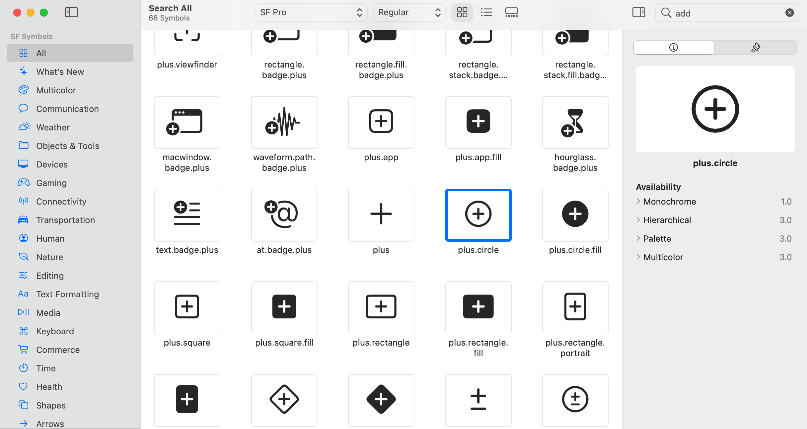
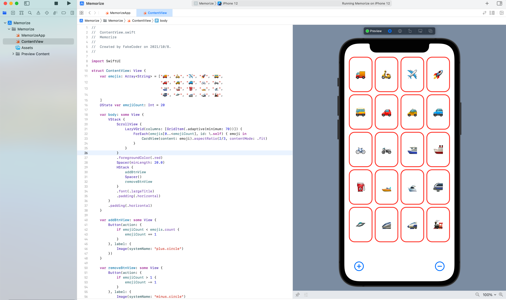

### CS193p Lec1-2

#### Lecture 1: Getting started with SwiftUI

* All parts of Xcode stay connected

  

* Meaning of the keyword "some" in "some View" declared in ContentView.swift:

  The type of this body is something that behaves like a View.

  Swift is a functional programming language, so the variable "body" is not in memory, it's calculated by complier through the function right after "some View".

* Preview

  Preview is a real time generated window, displaying our code into real UI.

  Option+Command+Enter calls the window from Xcode.

  Get it with these lines of code:

  ```swift
  struct ContentView_Previews: PreviewProvider {
      static var previews: some View {
          ContentView()
      }
  }
  ```

* ZStack and HStack

  ZStack: A view that overlays its children, aligning them in both axes.
  
  HStack: A view that arranges its children in a horizontal line.


#### Lecture 2: Learning more about SwiftUI

* Draw a simple card view with round rectangles and text, then organize them using ZStack

    ```swift
    struct ContentView: View {
        var body: some View {
            ZStack {
                RoundedRectangle(cornerRadius: 20.0)
                    .stroke(lineWidth: 3.0)
                    .foregroundColor(.red)
                RoundedRectangle(cornerRadius: 20.0)
                    .stroke(lineWidth: 3.0)
                    .foregroundColor(.red)
                Text("Hello!")
                    .font(.largeTitle)
            }
        }
    }
    ```

* Using struct to build more rectangles

    In SwiftUI, we wrap a customized view through struct, not function.

    ```swift
    struct ContentView: View {
        var body: some View {
            HStack {
                CardView()
                CardView()
                CardView()
            }
        }
    }
    
    struct CardView: View {
        var body: some View {
            ZStack {
                RoundedRectangle(cornerRadius: 20.0)
                    .stroke(lineWidth: 3.0)
                    .foregroundColor(.red)
                RoundedRectangle(cornerRadius: 20.0)
                    .stroke(lineWidth: 3.0)
                    .foregroundColor(.red)
                Text("Hello!")
                    .font(.largeTitle)
            }
        }
    }
    ```

* The struct CardView can be written in a more elegant way:

    ```swift
    struct CardView: View {
        var body: some View {
    		    let shape: RoundedRectangle = RoundedRectangle(cornerRadius: 20.0)
            ZStack {
                shape.stroke(lineWidth: 3.0).foregroundColor(.red)
    						shape.stroke(lineWidth: 3.0).foregroundColor(.red)
                Text("Hello!").font(.largeTitle)
            }
        }
    }
    ```

    The variable "shape" can not be declared as var, because "shape" doesn't change.

    If you insist, complier gives a warning: Variable 'shape' was never mutated; consider changing to 'let' constant. 

* Declare a variable:

    Apparently, the first declaration is most used.

    ```swift
    var isFaceUp: Bool = false
    
    var isFaceUp: Bool = {
    		return false
    }
    
    var isFaceUp: Bool {
    		false
    }
    ```

* Using "isFaceUp" to decide whether the CardView is upside or downside:

    ```swift
    struct ContentView: View {
        var body: some View {
            HStack {
                CardView(isFaceUp: true)
                CardView(isFaceUp: false)
                CardView(isFaceUp: false)
            }
            .foregroundColor(.red)
            .padding(.horizontal)
        }
    }
    
    struct CardView: View {
        var isFaceUp: Bool = false
        
        var body: some View {
            let shape: RoundedRectangle = RoundedRectangle(cornerRadius: 20.0)
            ZStack {
                if isFaceUp {
                    shape.fill().foregroundColor(.white)
                    shape.stroke(lineWidth: 3.0)
                    Text("Hello!").font(.largeTitle)
                } else {
                    shape.fill()
                }
            }
            .onTapGesture {
                isFaceUp = !isFaceUp /// Error: Cannot assign to property: 'self' is immutable
            }
        }
    }
    ```

    We use onTapGesture on ZStack to change the variable "isFaceUp" when a tap gesture is detected.

    But complier generates this error: Cannot assign to property: 'self' is immutable.

    This is related to SwiftUI's UI logic:

    * in "CardView", self is pointed at the CardView itself
    * variable "isFaceUp" is immutable and so is any View in SwiftUI
    * SwiftUI do not update it's UI, but rebuild it. And this do not infect performance, which making SwiftUI great.

    So how do we change "isFaceUp" here:

    * using @State, this turns stack variable "isFaceUp" into a pointer variable which pointing to some Boolean memory.

        It won't be used too much frequently.

        ```swift
        @State var isFaceUp: Bool = false
        ```

* Now that "isFaceUp" has been designed as a internal variable of CardView, we declare another variable "content":

    ```swift
    /// what CardView displays
    var content: String
    ```

    We can use ForEach to make logic more clear and maintainable:

    ```swift
    struct ContentView: View {
        var emojis: Array<String> = ["🚚", "🛵", "✈️", "🚀", "🚌",
                                     "🚗", "🚕", "🚙", "🚲", "🏍",
                                     "⛴", "🚢", "⛽️", "🚤", "🛥",
                                     "🚝", "🛸", "🚄", "🚅", "🚂",
        ]
        var emojiCount: Int = 4
        
        var body: some View {
            HStack {
                ForEach(emojis[0..<emojiCount], id: \.self) { emoji in
                    CardView(content: emoji)
                }
            }
            .foregroundColor(.red)
            .padding(.horizontal)
        }
    }
    ```

    ForEach's parameter "id" is used to identify each item in the loop, telling SwiftUI that each value in the array is unique, even though the syntax looks a little odd.

    We can also use variable "emojiCount" to decide how many emojis are needed to be rendered as CardView.

    * 1..<5

        means: 1, 2, 3, 4

    * 1...5

        Means: 1, 2, 3, 4, 5

* Using Buttons

    This is the way to create a button.

    ```swift
    Button(action: {
    		emojiCount += 1
    }, label: {
    		Text("Add Card")
    })
    ```

    Wrap the button with a variable, making our code structure more elegant.

    Spacer() is used to encapture any empty space between "add" and "remove".

    ```swift
    struct ContentView: View {
        var emojis: Array<String> = ["🚚", "🛵", "✈️", "🚀", "🚌",
                                     "🚗", "🚕", "🚙", "🚲", "🏍",
                                     "⛴", "🚢", "⛽️", "🚤", "🛥",
                                     "🚝", "🛸", "🚄", "🚅", "🚂",
        ]
        @State var emojiCount: Int = 4
        
        var body: some View {
            VStack {
                HStack {
                    ForEach(emojis[0..<emojiCount], id: \.self) { emoji in
                        CardView(content: emoji)
                    }
                }
                HStack {
                    add
                    Spacer()
                    remove
                }
                .padding(.horizontal)
            }
            .foregroundColor(.red)
            .padding(.horizontal)
        }
        
        var add: some View {
            Button(action: {
                emojiCount += 1
            }, label: {
                Text("Add Card")
            })
        }
        
        var remove: some View {
            Button(action: {
                emojiCount -= 1
            }, label: {
                Text("Remove Card")
            })
        }
    }
    ```

* SF Symbols

    With over 3,100 symbols, SF Symbols is a library of iconography designed to integrate seamlessly with San Francisco, the system font for Apple platforms.

    Download at https://developer.apple.com/sf-symbols/

    

    Find the name and use it like this:

    ```swift
    Image(systemName: "plus.circle")
    ```

* Using LazyVGrid

    Understanding differences between VStack and LazyVGrid

    * VStack uses all the space it can, including both directions: width and height
    * LazyVGrid uses all the width space horizontally for its columns

    ```swift
    LazyVGrid(columns: [GridItem(), GridItem(), GridItem(), GridItem()]) {
        ForEach(emojis[0..<emojiCount], id: \.self) { emoji in
    				/// set aspectRatio to restrict CardView's width/height
    		    CardView(content: emoji).aspectRatio(2/3, contentMode: .fit)
        }
    }
    ```

* Using ScrollView

    Just wrap LazyVGrid using ScrollView to make it scrollable.

    This is what we got for now:

    
