### CS193p Lec3-4

#### Lecture 3: MVVM and the Swift type system

* MVVM Architecture

    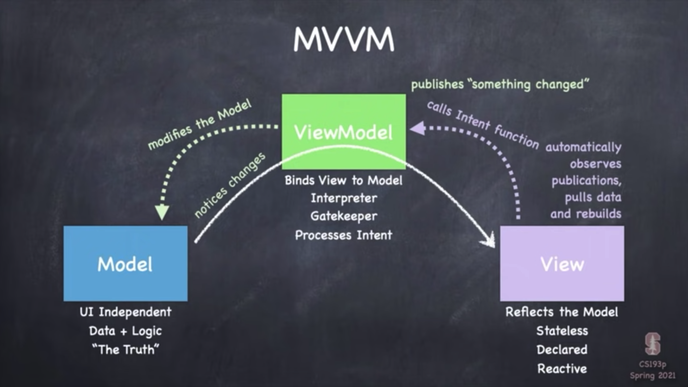

* Swift Type System

    * struct
    * class
    * protocal
    * type
    * enum
    * functions

* Differences between struct and class

    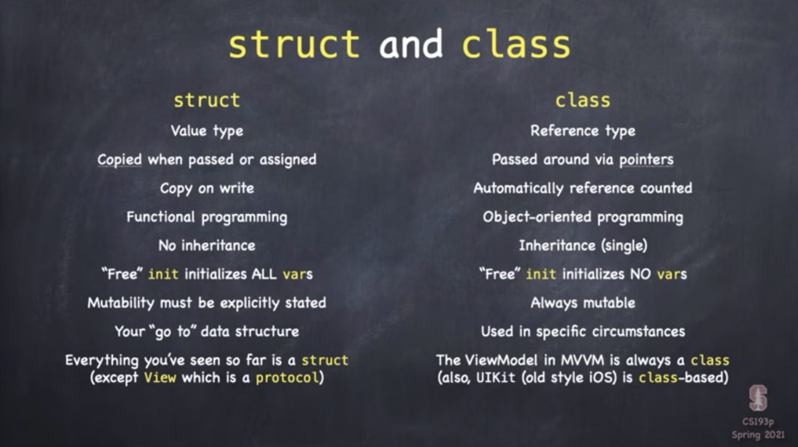
    


#### Lecture 4: Memorize Game Logic

* enum

    * Declaring enum: another variety of data structure

        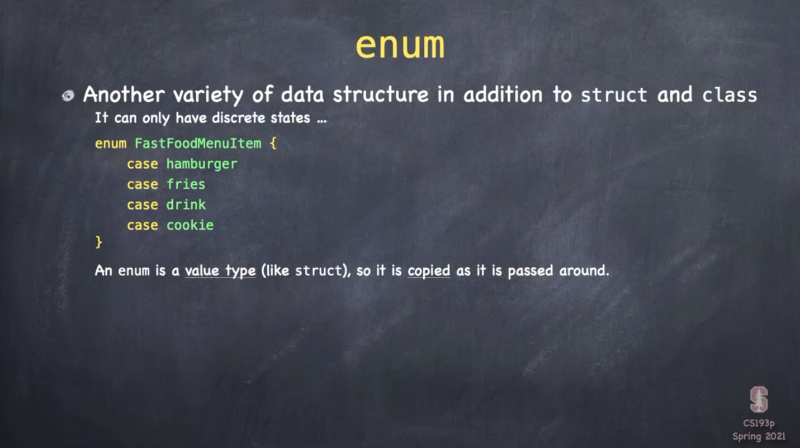

    * Associated Data

        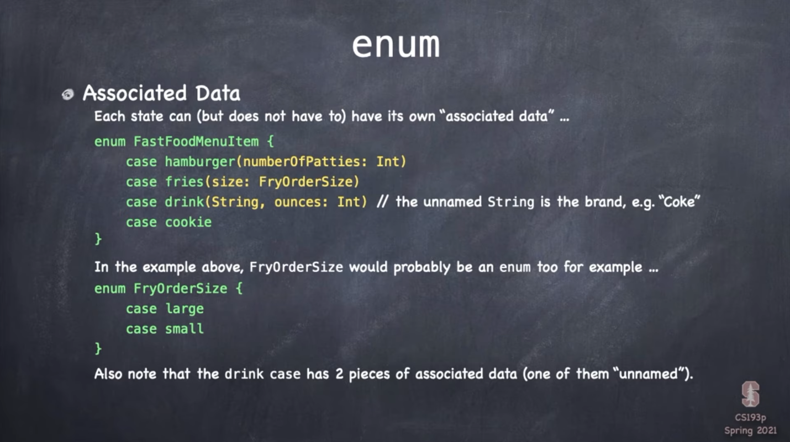

    * Setting the value of an enum
    
        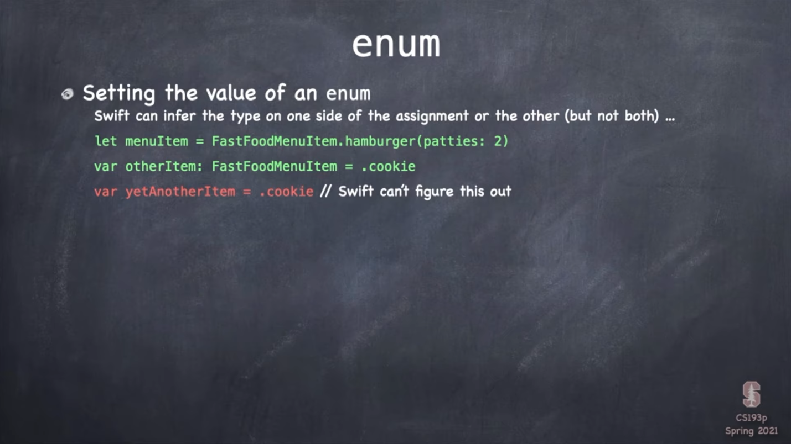

    * Using switch
    
        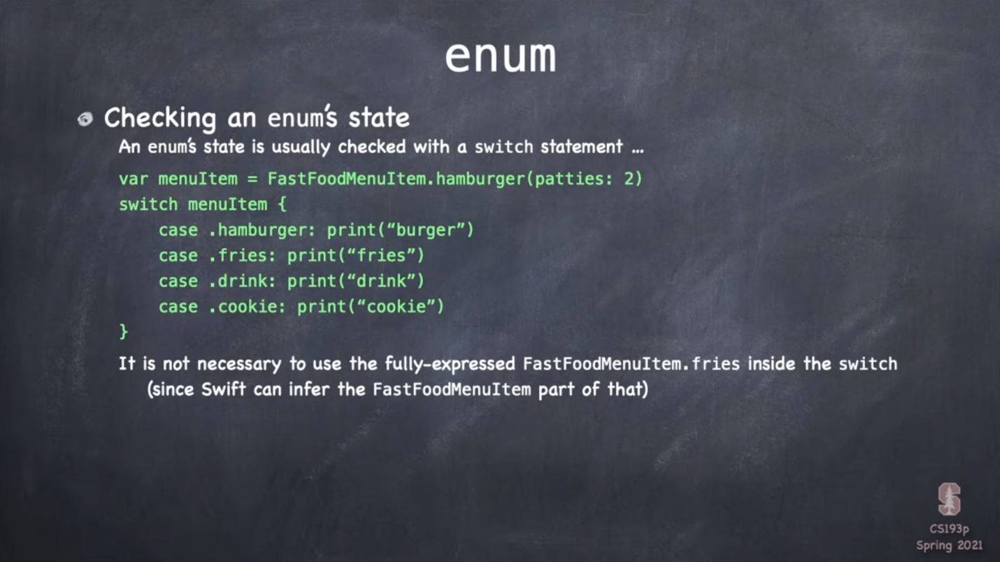
        
        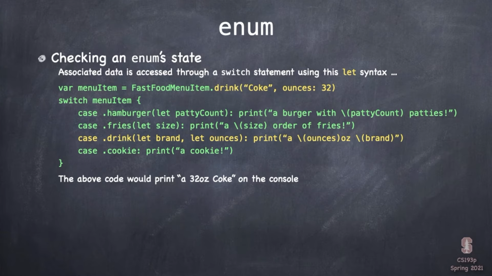
        
        ```swift
        /// switch supporting other kinds of data
        let s: String = "hello"
        switch s {
        		case "hello":
          			print("hello")
          			print("hello again")
            case "goodbye":
          			print("goodbye")
            default:
          			print("default")
        }
        ```
        
    * enum can have methods and vars
    
        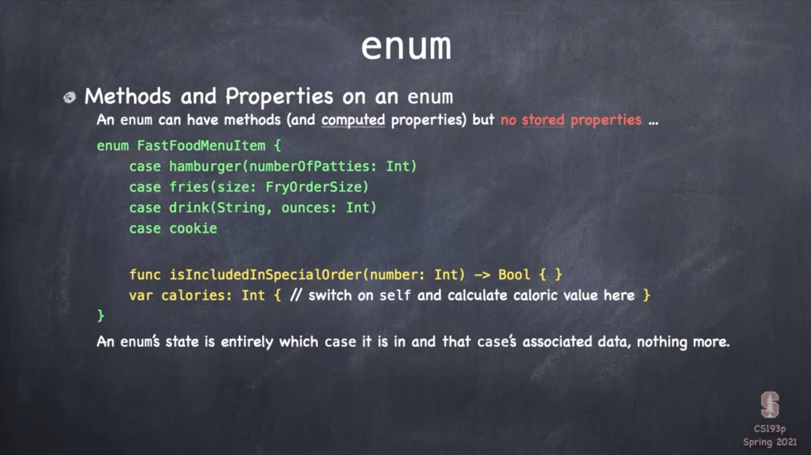
    
* Optionals

    Just an enum

    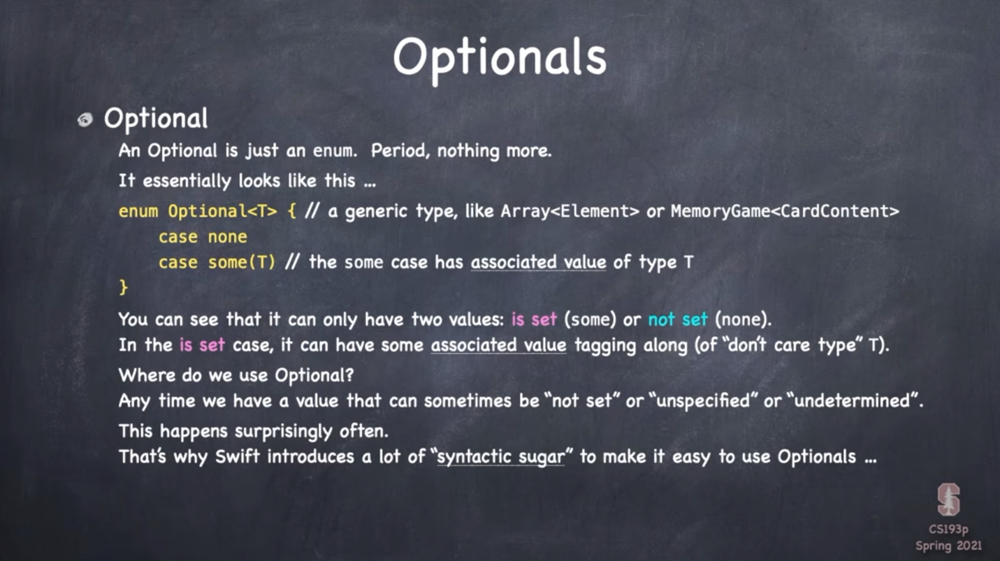

    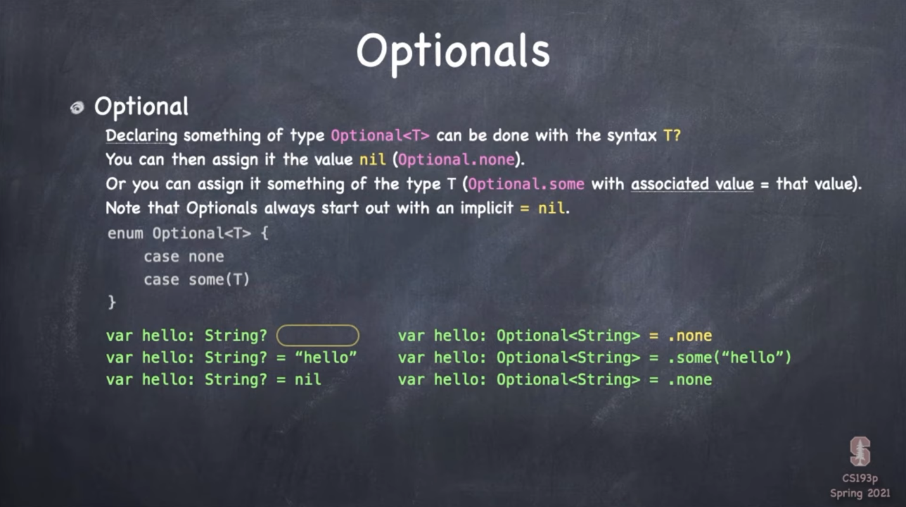
    
    An elegant way to access an optional variable
    
    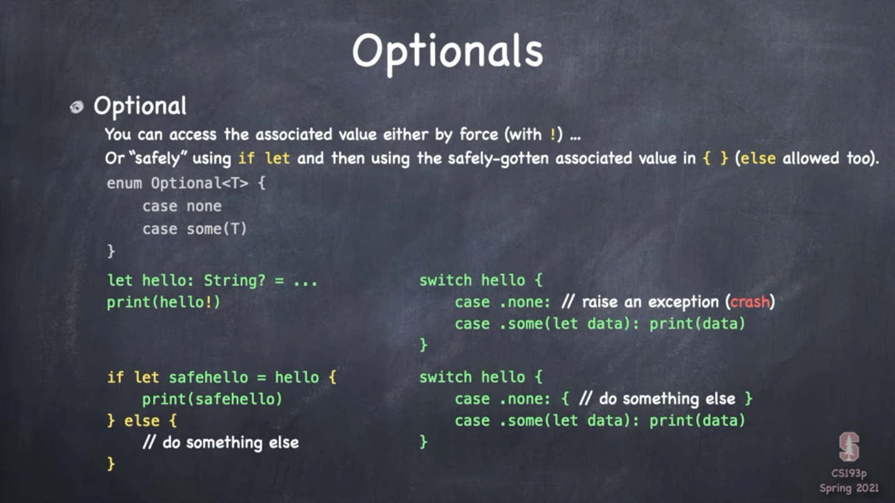
    
    understanding syntax ??
    
    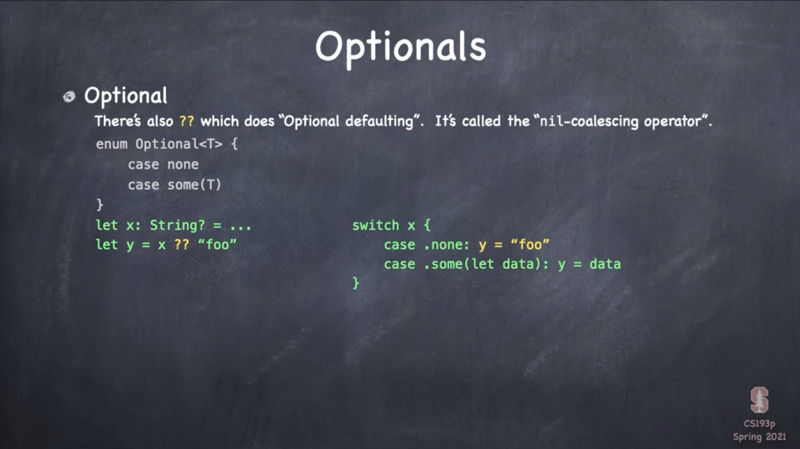
    
    optional chain
    
    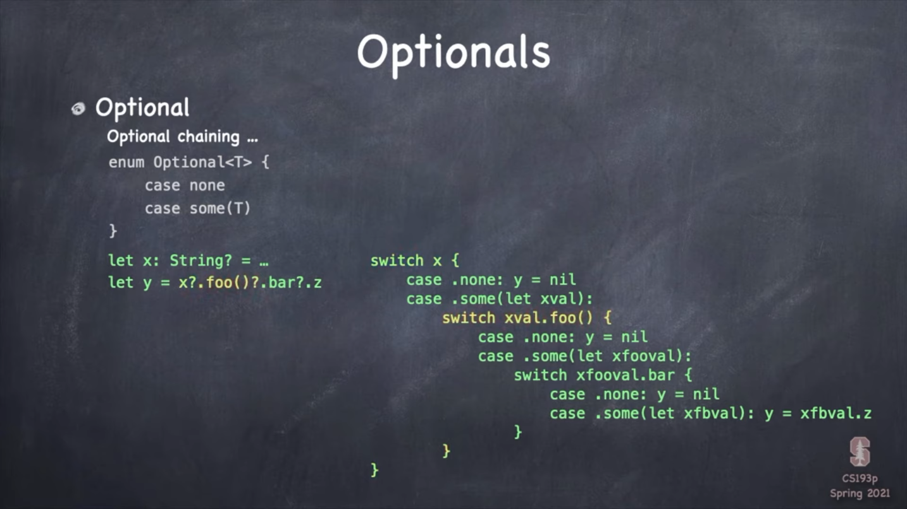

