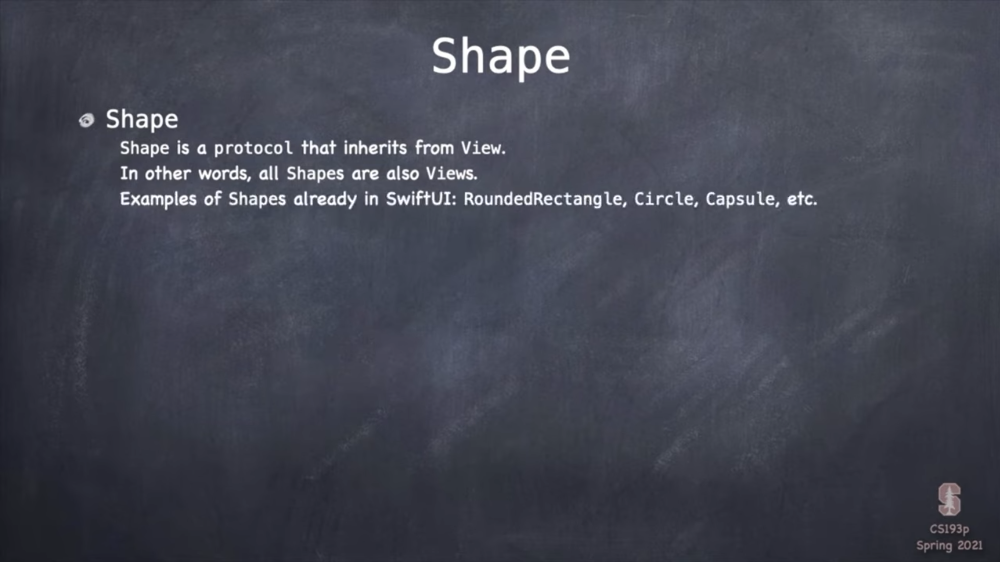

### CS193p Lec5-6

#### Lecture 5: Properties Layout @ViewBuilder

* Our View is readonly

    Views are created and tossed out all the time, only the "bodies" stick around very long.

    So views don't live long enough to need to be mutable entities.

    Actually, this could be a feature, because views are mostly supposed to be stateless since views just drawing the model all the time. Views don't need any state of their own, mostly.

* @State

    ```swift
    @State private var somethingTemporary: SomeType
    ```

    Vars marked with @State can only be accessed inside View.

    @State rebuild the body when changed.

* How @State works

    Vars marked with @State are actually stored in the heap.

    Rebuilded view will continue to point at our view,  but changes to our view will not dump @State vars.

* Property Observers

    

* @ViewBuilder

    @ViewBuilder is a list of views.


#### Lecture 6: Protocols Shapes

* Protocals

    

* Shapes

    

    