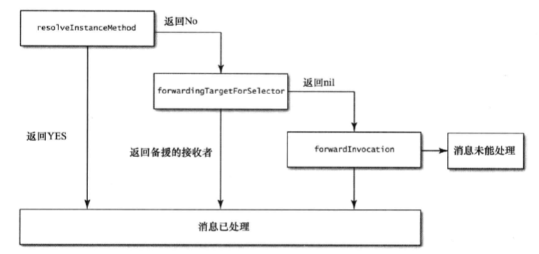
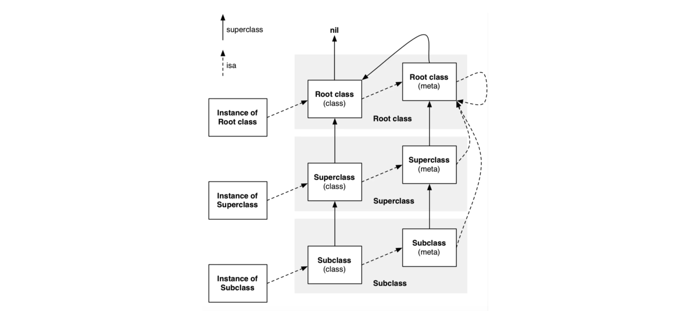

### 第二章: 对象、消息、运行期

#### No.6: 理解property

* OC把实例变量当作存储偏移量的特殊变量，由类对象管理，偏移量会在运行时查找

  这样无论何时访问实例变量，总能找到正确的位置，并支持运行时向类增加实例变量

* @property根据我们指定的内存管理语义生成属性，并生成存取方法，需要注意的是weak和unsafe_unretained

  * weak: 属性所指向的对象销毁时，属性值也会清空
  * unsafe_unretained: 属性所指向的对象销毁时，属性值不会清空

* @synthesize为我们定义的属性创建别名

* @dynamic告诉编译器不为制定属性创建存取方法，而由我们手动创建

* atomic和nonatomic，atomic使用同步锁保证每次读取的值都是有效的，但并不保证线程安全，且同步锁开销较大

  因此我们应该使用nonatomic避免无谓开销


#### No.7: 在对象内部尽量直接访问实例变量

* 通过属性访问 vs 直接访问

  我们应该在读取实例变量时直接访问，设置实例变量时通过属性来做

* 直接访问需要注意的点

  * 不经过runtime的消息转发而直接访问内存，速度较快
  * 绕过内存管理语义，例如ARC下直接访问声明为copy的属性，则不会拷贝该属性，只会保留新值并释放旧值
  * 不触发KVO
  * 不能在存取方法里添加断点debug

* 初始化方法里我们应该直接访问，因为子类可能会override设置方法

* 懒加载的属性必须通过属性访问，否则永远不会执行其懒加载方法


#### No.8: 理解object equality

* NSObject协议中的isEqual:用于判定等同性，内部实现规则是当且仅当指针值完全相同，两个对象才相等

  若isEqual:判定两个对象相等，则两个对象的hash值也想等

  若两个对象的hash值相等，则两个对象不一定相等

  ```objective-c
  NSString *a1 = @"aaa";
  NSString *a2 = [NSString stringWithString:@"aaa"];
  NSString *a3 = @"aaaaaa";
  NSLog(@"%p, %p, %lu", a1, &a1, (unsigned long)a1.hash);
  NSLog(@"%p, %p, %lu", a2, &a2, (unsigned long)a2.hash);
  NSLog(@"%p, %p, %lu", a3, &a3, (unsigned long)a3.hash);
  
  // 2021-10-04 22:18:47.940473+0800 EOC[10148:828685] 0x100004018, 0x7ffeefbff458, 516200022
  // 2021-10-04 22:18:47.940875+0800 EOC[10148:828685] 0x100004018, 0x7ffeefbff450, 516200022
  // 2021-10-04 22:18:47.940908+0800 EOC[10148:828685] 0x100004038, 0x7ffeefbff448, 8835314326513740
  ```

* 关于hash方法

  * 只有NSSet加入新值和NSDictionary加入新key时调用，因为这两种都需要保证唯一性
  * hash方法可以被我们override，override hash方法时需要注意效率问题，要在collision频率和运算复杂度之间做tradeoff

* 检测对象等同性需要override isEqual:和hash方法，不要盲目地逐个检测每条属性


#### No.9: 用class cluster隐藏实现细节

* OC系统框架普遍使用类族模式，把实现细节隐藏在简单的公共借口背后，例如UIButton和大部分collection，我们可以使用工厂模式实现自己类族模式

  判断类时我们应该用isKindOfClass:方法，而不是用==

  ```objective-c
  NSArray *array = @[@1, @2, @3];
  NSLog(@"%@", array.class);
  NSLog(@"%d", array.class == NSArray.class);
  NSLog(@"%d", [array isKindOfClass:NSArray.class]);
  
  // 2021-10-04 22:51:05.613016+0800 EOC[10319:849813] __NSArrayI
  // 2021-10-04 22:51:05.613283+0800 EOC[10319:849813] 0
  // 2021-10-04 22:51:05.613314+0800 EOC[10319:849813] 1
  ```

* 一般情况下不要继承类族的公共抽象基类，这往往很复杂，需要阅读其开发文档


#### No.10: 在既有类中使用关联对象存放自定义数据

* 关联对象可以指定内存管理语义，把两个对象连接起来，但仅在其他做法不可用时才选用关联对象，因为关联对象可能会引入难以debug的bug


#### No.11: 理解objc_msgSend作用

* OC对象的每个方法都会通过objc_msgSend转换成类似以下的形式

  内部实现中，objc_msgSend做了尾调用优化，防止过早stack overflow，所以我们能在debug的backtrace中看到objc_msgSend

  ```objective-c
  <return_type> class_selector(id self, SEL _cmd, ...)
  ```


#### No.12: 理解消息转发机制

* 对象无法响应selector时触发消息转发流程

  * 通过runtime的动态方法解析，可以在用到某个方法时再将其加入类中，失败return NO

  * 动态方法解析失败，可以把消息转发给其他对象，失败return nil

  * 开启完整消息转发机制，封装该消息的selector、target和params以创建NSIvocation对象

    按照hierachy挨个发送消息，直到NSObject，若还是不行，则触发doesNotRecognizeSelector:抛出异常

  

* CALayer通过在resolveInstanceMethod为每个动态添加的属性实现getter和setter

  CALayer这样的类称之为兼容于键值编码的(key-value coding compliant)


#### No.13: 用method swizzling调试黑盒方法

* 通过method swizzling可以在运行期，向类新增方法和替换已有方法

  ```objective-c
  #import <objc/runtime.h>
  
  @implementation UIViewController (Tracking)
  
  + (void)load {
      static dispatch_once_t onceToken;
      dispatch_once(&onceToken, ^{
          Class class = [self class];
  
          SEL originalSelector = @selector(viewWillAppear:);
          SEL swizzledSelector = @selector(xxx_viewWillAppear:);
  
          Method originalMethod = class_getInstanceMethod(class, originalSelector);
          Method swizzledMethod = class_getInstanceMethod(class, swizzledSelector);
  
          // When swizzling a class method, use the following:
          // Class class = object_getClass((id)self);
          // ...
          // Method originalMethod = class_getClassMethod(class, originalSelector);
          // Method swizzledMethod = class_getClassMethod(class, swizzledSelector);
  
          BOOL didAddMethod =
              class_addMethod(class,
                  originalSelector,
                  method_getImplementation(swizzledMethod),
                  method_getTypeEncoding(swizzledMethod));
  
          if (didAddMethod) {
              class_replaceMethod(class,
                  swizzledSelector,
                  method_getImplementation(originalMethod),
                  method_getTypeEncoding(originalMethod));
          } else {
              method_exchangeImplementations(originalMethod, swizzledMethod);
          }
      });
  }
  
  #pragma mark - Method Swizzling
  
  - (void)xxx_viewWillAppear:(BOOL)animated {
      [self xxx_viewWillAppear:animated];
      NSLog(@"viewWillAppear: %@", self);
  }
  
  @end
  ```


#### No.14: 理解类对象

* objc_object和objc_class

  ```objective-c
  typedef struct objc_object {
  		Class isa;
  } *id;
  
  typedef struct objc_class *Class; 
  struct objc_class {
      Class isa;
      Class super_class;
      const char *name;
      long version;
      long info;
      long instance_size;
      struct objc_ivar_list *ivars;
      struct objc_method_list **methodLists; struct objc_cache *cache;
      struct objc_protocol_list *protocols;
  };
  ```

* 继承关系

  实例方法存储在类对象里，类方法存储在元类里

  

* 判断类时不要直接比较类对象(object.class)，而是直接使用isKindOfClass:和isMemberOfClass:，因为某些类对象可能实现了消息转发功能

  isKindOfClass:判断对象是否为某类或其派生类的实例

  isMemberOfClass:判断对象是否为某个特定类的实例

  ```objective-c
  NSMutableDictionary *dict = [NSMutableDictionary new];
  [dict isMemberOfClass:[NSDictionary class]]; ///< NO
  [dict isMemberOfClass:[NSMutableDictionary class]]; ///< YES
  [dict isKindOfClass:[NSDictionary class]]; ///< YES
  [dict isKindOfClass:[NSArray class]]; ///< NO
  ```