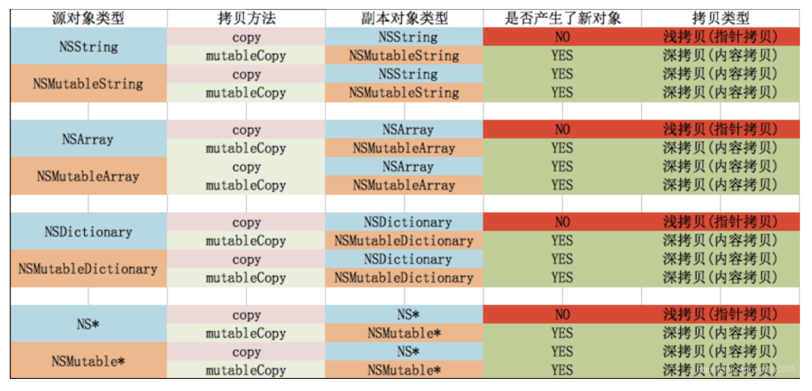

### 第三章: 接口与API设计

#### No.15: 用前缀避免命名空间冲突

* 我们应该为类名加上特定的前缀，三个字母以上，可以由公司、个人或应用程序构成，并在所有代码中均用此前缀
* Apple保留所有两个字母开头的命名使用权
* 若自己开发的pod中用到了第三方库，则也应为其加上特定前缀


#### No.16: 提供"全能初始化方法"

* 全能初始化方法意思是，一个类的多个初始化方法里面都会调用的初始化方法

  通过设计这样一个全能初始化方法，当以后底层数据格式变动时，只需更改全能初始化方法的实现即可

* 若该类遵从NSCopying协议，则应该有两个全能初始化方法

* 如果子类的全能初始化方法和超类的不同，则应override超类的全能初始化方法，避免出现不符合子类特定预期的情况


#### No.17: 实现description方法

* 重写description方法，可以改变NSLog该对象时控制台里打印的数据
* 重写debugDescription方法，可以改变po该对象时控制台里打印的数据


#### No.18: 尽量使用不可变对象

* 对外声明的属性尽可能设计成readonly，若需要在.m里更改，可以在extension中重写为readwrite
* 对于可变的collection，我们应该内部重写其getter方法，返回不可变的版本，避免出现数据混乱


#### No.19: 使用清晰而协调的命名方式

* 命名时应遵循OC命名规范，方法名应该言简意赅且读起来像句子
* 确保代码风格和现有代码风格一致


#### No.20: 为私有方法名添加前缀

* 为.m里的私有方法添加p_前缀，表示private，与公共方法区别开

  不要仅用一个下划线区分，单个下划线前缀是Apple为自己保留的，例如UIViewController有一个_resetViewController私有方法


#### No.21: 理解OC错误模型

* OC中只应在发生令程序崩溃的严重错误时，才使用异常

* 一般错误应该用delegate method或NSError对象处理

  * delegate method

    例如NSURLConnectionDelegate

    ```objective-c
    - (void)connection:(NSURLConnection *)connection didFailWithError:(NSError *)error
    ```

  * NSError

    ```objective-c
    - (BOOL)doSomething:(NSError**)error;
    
    NSError *error = nil;
    BOOL ret = [object doSomething:&error]; if (error) {
    		// There was an error
    }
    ```


#### No.22: 理解NSCopying

* 若需要自己的类能copy或mutableCopy，则需要实现NSCopying协议或NSMutableCopying

  实现NSCopying协议，只需实现其中的copyWithZone:方法，里面调用类的全能初始化方法完成所有配置

  ```objective-c
  #import <Foundation/Foundation.h>
  
  @interface EOCPerson : NSObject <NSCopying>
  @property (nonatomic, copy, readonly) NSString *firstName;
  @property (nonatomic, copy, readonly) NSString *lastName;
  -(id)initWithFirstName:(NSString*)firstName andLastName:(NSString*)lastName;
  @end
  
  -(id)copyWithZone:(NSZone*)zone {
      EOCPerson *copy = [[[self class] allocWithZone:zone] initWithFirstName:_firstName 																																								 andLastName:_lastName];
      return copy;
  }
  ```

* 复制对象时应该尽量执行浅拷贝，若需要深拷贝，则应该新增一个专门执行深拷贝的方法

  collection默认情况下都是执行浅拷贝

* collection的拷贝行为

  