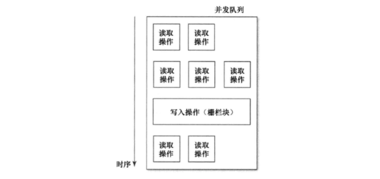

### 第六章: 块与大中枢派发

#### No.37:理解block

* block是一种词法闭包，可接收参数，可返回值
  
* __block修饰符

  |              | 不使用__block                               | 使用__block                         |
  | ------------ | ------------------------------------------- | ----------------------------------- |
  | 外部栈区变量 | 拷贝，因此block内部修改不影响外部值         | 拷贝，block执行完后重新赋值外部变量 |
  | 外部堆区变量 | 不做处理，因此block内部修改会触发编译器报错 | 深拷贝                              |

* block内存结构

  invoke变量是一个void*型函数指针，捕获到的变量不是对象本身，而是指向这些对象的指针变量

  

* block声明时被分配在栈上，也可以分配在堆上和全局

  分配在栈上的block被copy到堆上后，就是一个具有引用计数的OC对象

  ```objective-c
  void (^block)();
  if ( /* some condition */ ) {
  		block = ^{
  				NSLog(@"Block A");
  		};
  } else {
  		block = ^{ 
  				NSLog(@"Block B");
  		};
  }
  block();
  // 有时能运行 取决于编译器是否覆写block在内存中的位置
  ```

  应该对block发送copy消息，拷贝到堆上，这样可以安全地调用block

  ```objective-c
  void (^block)();
  if ( /* some condition */ ) {
      block = [^{
      		NSLog(@"Block A");
      } copy]; 
  } else {
      block = [^{
      		NSLog(@"Block B");
      } copy];
  }
  block();
  ```


#### No.38: 为常用的block创建typedef

* block的声明方式

  ```objective-c
  // As a local variable:
  returnType (^blockName)(parameterTypes) = ^returnType(parameters) {...};
  
  // As a property:
  @property (nonatomic, copy, nullability) returnType (^blockName)(parameterTypes);
  
  // As a method parameter:
  - (void)someMethodThatTakesABlock:(returnType (^nullability)(parameterTypes))blockName;
  
  // As an argument to a method call:
  [someObject someMethodThatTakesABlock:^returnType (parameters) {...}];
  
  // As a parameter to a C function:
  void SomeFunctionThatTakesABlock(returnType (^blockName)(parameterTypes));
  
  // As a typedef:
  typedef returnType (^TypeName)(parameterTypes);
  TypeName blockName = ^returnType(parameters) {...};
  ```

* 使用typedef定义block，可使block的使用更加简单，定义时需要注意命名规范


#### No.39: 使用handler块降低代码分散程度

* 我们可以通过delegate把对象和相关业务逻辑绑定在一起，但使用handler块能有效降低代码分散程度
* 设计API时可以增加queue参数，让调用者决定在哪个队列上执行handler


#### No.40: 用block引用所属对象时要注意循环引用

* 使用block时需要尤其注意循环引用，可用__weak修饰的weakSelf在block中使用当前类的属性

  ```objective-c
  __weak typeof(self) weakSelf = self;
  ```

* 在开发pod时，应该由我们在内部接触循环引用，而不能把责任推给调用者


#### No.41: 多用派发队列，少用同步锁

* GCD之前，通常使用@synchronized保证同步机制，然而对self频繁加锁时，这种锁会按顺序执行，效率低下

  直接使用NSLock和NSRecursiveLock这种锁对象，一旦遇到死锁，解决会非常麻烦

* GCD之后，使用GCD的串行同步队列可保证同步机制，而且线程安全

  因为存取方法都安排在序列化的队列里执行，不会有其他线程中途插入进来修改

  ```objective-c
  _syncQueue = dispatch_queue_create("com.effectiveobjectivec.syncQueue", NULL);
  
  -(NSString*)someString {
      __block NSString *localSomeString;
      dispatch_sync(_syncQueue, ^{
          localSomeString = _someString;
      });
  		return localSomeString;
  }
  
  -(void)setSomeString:(NSString*)someString {
      // 此处可以改成异步派发dispatch_async
      // 当且仅当拷贝block的时间小于block执行时间时
  		dispatch_sync(_syncQueue, ^{ 
  				_someString = someString;
  		});
  }
  ```

* 使用GCD的barrier实现多个getter并发执行，setter和getter不能并发执行

    
  
  ```objective-c
  _syncQueue = dispatch_get_global_queue(DISPATCH_QUEUE_PRIORITY_DEFAULT, 0);
  
  -(NSString*)someString {
  		__block NSString *localSomeString;
  		dispatch_sync(_syncQueue, ^{
  				localSomeString = _someString;
  		});
  		return localSomeString;
  }
  
  -(void)setSomeString:(NSString*)someString {
  		dispatch_barrier_async(_syncQueue, ^{
  				_someString = someString;
  		});
  }
  ```


#### No.42: 多用GCD，少用performSelector系列方法

* performSelector系列方法的缺点

  * 有时候因无法确定要执行的selector是什么，所以ARC不能插入适当的内存管理方法
  * 可携带的参数最多两个，过于局限

* 把任务放在指定线程上执行，最好应该使用GCD

  ```objective-c
  // Using performSelectorOnMainThread:withObject:waitUntilDone:
  [self performSelectorOnMainThread:@selector(doSomething) withObject:nil waitUntilDone:NO];
  
  // Using dispatch_async
  // (or if waitUntilDone is YES, then dispatch_sync)
  dispatch_async(dispatch_get_main_queue(), ^{
  		[self doSomething];
  });
  ```


#### No.43: 掌握GCD和操作队列的使用时机

* NSOperationQueue是用纯C的GCD实现的OC对象
* NSOperationQueue的优势
  * 支持取消某个操作
  * 可以指定操作间的依赖关系
  * 可以指定操作间的优先级
  * 支持KVO观察NSOperation对象的属性，因为NSOperationQueue是OC对象
  * 可继承NSOperation定义自己的操作
* NSNotificationCenter底层使用NSOperationQueue实现


#### No.44: 通过dispatch group根据系统资源状况来执行任务

* dispatch group支持归入一堆任务，并在全部执行完毕时通知我们

* dispatch group支持根据系统资源状况，在并发队列里同时执行多项任务，而不用我们去计算系统资源状况

  ```objective-c
  dispatch_queue_t queue = dispatch_get_global_queue(DISPATCH_QUEUE_PRIORITY_DEFAULT, 0);
  dispatch_group_t dispatchGroup = dispatch_group_create();
  for (id object in collection) {
  		dispatch_group_async(dispatchGroup, queue, ^{ [object performTask]; });
  }
  
  // DISPATCH_TIME_FOREVER表示会一直等待dispatchGroup全部执行完毕
  // 会阻塞当前线程
  dispatch_group_wait(dispatchGroup, DISPATCH_TIME_FOREVER);
  // Continue processing after completing tasks
   
  // 支持dispatchGroup全部执行完毕后执行自定义的逻辑操作
  // 支持指定执行队列
  // 不会阻塞当前线程
  dispatch_queue_t notifyQueue = dispatch_get_main_queue();
  dispatch_group_notify(dispatchGroup, notifyQueue, ^{
  		// Continue processing after completing tasks
  });
  ```


#### No.45: 使用dispatch_once执行只需运行一次的线程安全代码

* GCD之前，实现单例通常用@synchronized来保证线程安全

  ```objective-c
  + (id)sharedInstance {
      static EOCClass *sharedInstance = nil;
      @synchronized(self) {
          if (!sharedInstance) {
  		        sharedInstance = [[self alloc] init];
          }
      }
      return sharedInstance;
  }
  ```

* GCD之后，使用dispatch_once实现更加高效的单例

  注意dispatch_once_t类型的onceToken应该是static类型

  ```objective-c
  + (id)sharedInstance {
      static EOCClass *sharedInstance = nil;
      static dispatch_once_t onceToken;
      dispatch_once(&onceToken, ^{
  		    sharedInstance = [[self alloc] init];
      });
      return sharedInstance;
  }
  ```


#### No.46: 不要使用dispatch_get_current_queue

* dispatch_get_current_queue函数的行为往往和我们预期不同，已经废弃，只做调试用

* 派发队列是按层级组织的，不能用某个队列来描述当前队列

  